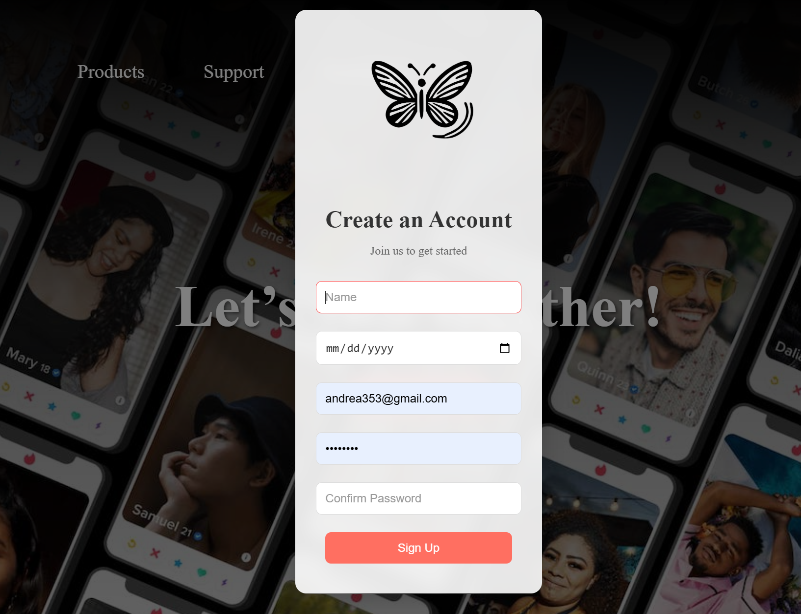
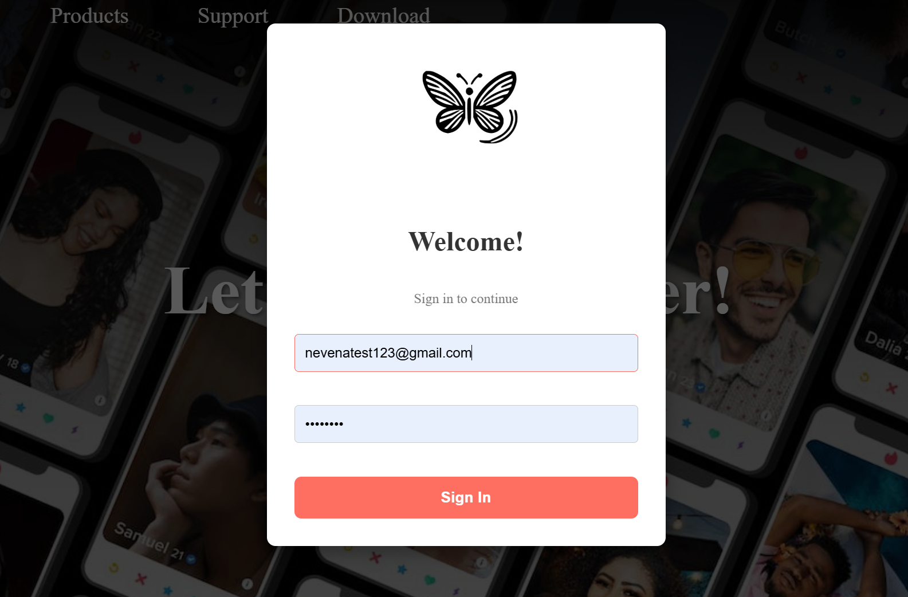
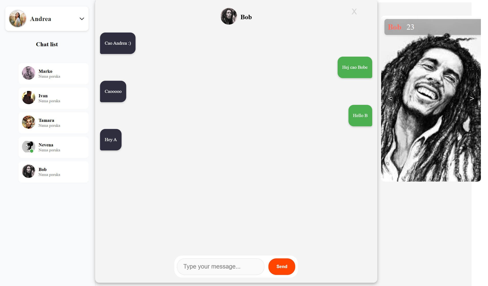

# VibrA - A Dating Application

VibrA is a modern dating application designed to provide a fast, secure, and intuitive user experience. The frontend is built using **React (Vite) with TypeScript**, while the backend uses **Node.js (Express)** and **MongoDB Atlas** for data management. The application includes advanced features such as real-time chat, JWT token authentication, and user image management.

---

## 📋 Table of Contents
1. [Technologies](#technologies)
2. [Installation and Setup](#installation-and-setup)
3. [Authentication and Security](#authentication-and-security)
4. [Real-Time Chat](#real-time-chat)
5. [Image Management](#image-management)
6. [Project Structure](#project-structure)
7. [Screenshots](#screenshots)
8. [Contact](#contact)
   
---

## 🛠️ Technologies

### Frontend
- **React (Vite)** - Fast and modern frontend platform.
- **TypeScript** - Ensures type safety and reduces errors.
- **SCSS** - Advanced styling for responsive and modern design.
- **React Router** - Handles routing and navigation.
- **Axios** - HTTP communication with the backend.

### Backend
- **Node.js** - JavaScript runtime for building the server.
- **Express** - Framework for handling HTTP requests efficiently.
- **MongoDB Atlas** - Cloud database for scalable data storage.
- **Mongoose** - ODM (Object Data Modeling) for MongoDB.
- **JSON Web Token (JWT)** - Secure user authentication.
- **bcryptjs** - Password encryption for enhanced security.
- **Socket.io** - Real-time communication for chat functionality.

---

## 🖼️ Screenshots

- **Home Page**  
    
  Description: The home page with basic information about the application.

- **Registration**  
    
  Description: Form for new user registration.

- **Login**  
    
  Description: Form for existing user login.

- **User Profile**  
    
  Description: User profile page with images and information.

- **Real-Time Chat**  
    
  Description: Real-time chat window for user communication.

## 🚀 Installation and Setup

### 1. Clone the Repository
```bash
git clone https://github.com/yourusername/vibra.git
cd vibra

### Start the Backend

cd backend
npx nodemon server.js

### Start the Frontend

cd frontend
npm install
npm run dev
