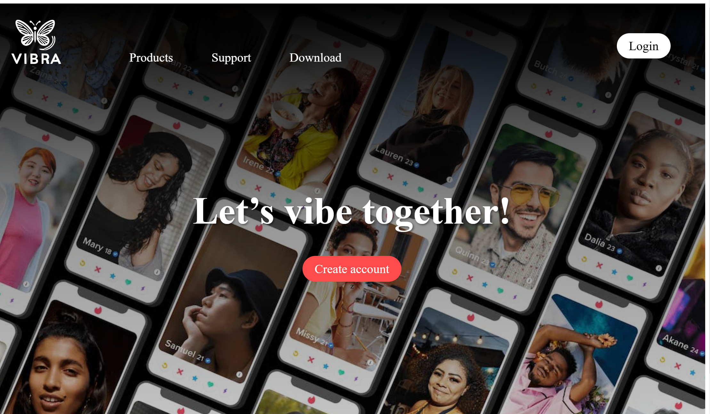
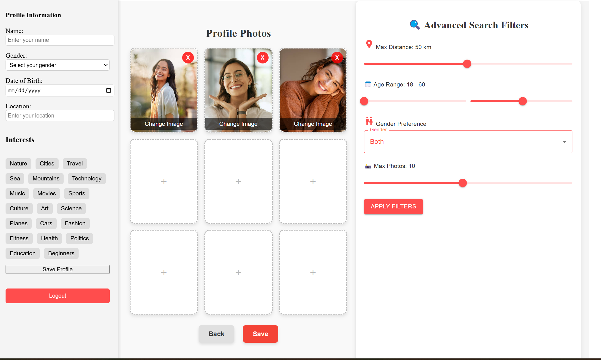

# VibrA - A Dating Application

VibrA is a modern dating application designed to provide a fast, secure, and intuitive user experience. The frontend is built using **React (Vite) with TypeScript**, while the backend uses **Node.js (Express)** and **MongoDB Atlas** for data management. The application includes advanced features such as real-time chat, JWT token authentication, and user image management.

---

## 📋 Table of Contents
1. [Technologies](#technologies)
2. [Installation and Setup](#installation-and-setup)
3. [Authentication and Security](#authentication-and-security)
4. [Real-Time Chat](#real-time-chat)
5. [Image Management](#image-management)
6. [Project Structure](#project-structure)
7. [Screenshots](#screenshots)
8. [Contact](#contact)

---

## 🛠️ Technologies

### Frontend
- **React (Vite)** - A fast and modern frontend platform for building user interfaces.
- **TypeScript** - Adds static typing to JavaScript, reducing errors and improving code quality.
- **SCSS** - A powerful CSS preprocessor for writing clean and maintainable styles.
- **React Router** - Handles client-side routing and navigation seamlessly.
- **Axios** - A promise-based HTTP client for making API requests to the backend.

### Backend
- **Node.js** - A JavaScript runtime for building scalable and efficient server-side applications.
- **Express** - A minimal and flexible web application framework for Node.js.
- **MongoDB Atlas** - A fully managed cloud database service for storing application data.
- **Mongoose** - An Object Data Modeling (ODM) library for MongoDB, simplifying database interactions.
- **JSON Web Token (JWT)** - A secure method for user authentication and authorization.
- **bcryptjs** - A library for hashing passwords, ensuring user data security.
- **Socket.io** - Enables real-time, bidirectional communication between clients and servers.

---

## 🚀 Installation and Setup

### 1. Clone the Repository
```bash
git clone https://github.com/yourusername/vibra.git
cd vibra
2. Set Up the Backend
Navigate to the backend folder:

bash
Copy
cd backend
Install dependencies:

bash
Copy
npm install
Start the backend server:

bash
Copy
npx nodemon server.js
3. Set Up the Frontend
Navigate to the frontend folder:

bash
Copy
cd frontend
Install dependencies:

bash
Copy
npm install
Start the development server:

bash
Copy
npm run dev
🔒 Authentication and Security
User Registration and Login: Users can create an account and log in using their email and password.

JWT Token: Upon successful login, a JSON Web Token (JWT) is generated and stored in an httpOnly cookie for secure authentication.

Protected Routes: Certain routes (e.g., user profile, chat) are protected using middleware to ensure only authenticated users can access them.

💬 Real-Time Chat
Socket.io Integration: Real-time communication is enabled using Socket.io, allowing users to send and receive messages instantly.

Message Persistence: All chat messages are stored in the MongoDB database, ensuring they are accessible even after the user logs out.

Chat Interface: Users can click on another user's profile to open a chat window and start a conversation.

📸 Image Management
Image Upload: Users can upload images to their profile, which are stored on a cloud service (e.g., Cloudinary, AWS S3).

Image URLs: The URLs of uploaded images are saved in the MongoDB database and displayed on the user's profile.

Profile Display: The profile page showcases up to 9 images in a clean and responsive grid layout.

📂 Project Structure
Copy
vibra/
 ├── backend/
 │   ├── controllers/    # Logic for handling API requests
 │   ├── models/         # MongoDB schemas and data models
 │   ├── routes/         # API endpoints and routing logic
 │   ├── middleware/     # Custom middleware (e.g., authentication)
 │   ├── config/         # Configuration files (e.g., database connection)
 │   ├── server.js       # Entry point for the backend server
 │   ├── .env            # Environment variables (e.g., API keys, secrets)
 │
 ├── frontend/
 │   ├── src/
 │   │   ├── assets/     # Static resources (e.g., images, fonts)
 │   │   ├── components/ # Reusable UI components
 │   │   ├── pages/      # Application pages (e.g., Home, Profile, Chat)
 │   │   ├── styles/     # SCSS files for styling
 │   │   ├── App.tsx     # Main React component
 │   │   ├── main.tsx    # Entry point for the frontend
 │   ├── vite.config.ts  # Vite configuration file
 │   ├── tsconfig.json   # TypeScript configuration file
 │
 ├── README.md           # Project documentation
 ├── package.json        # Project dependencies and scripts
 ├── .gitignore          # Files and folders to ignore in Git
## 🖼️ Screenshots

### Home Page
  
*Description: The home page provides an overview of the application and its features.*

### Registration
  
*Description: The registration page allows new users to create an account.*

### Login
  
*Description: The login page enables existing users to access their accounts.*

### User Profile
  
*Description: The user profile page displays personal information and uploaded images.*

### Real-Time Chat
  
*Description: The chat page allows users to communicate in real-time.*

---

## 📩 Contact

For questions, suggestions, or collaboration opportunities, feel free to reach out:

- **Email:** [your-email@example.com](mailto:your-email@example.com)
- **GitHub:** [yourusername](https://github.com/yourusername)
- **LinkedIn:** [Your Name](https://linkedin.com/in/yourprofile)
